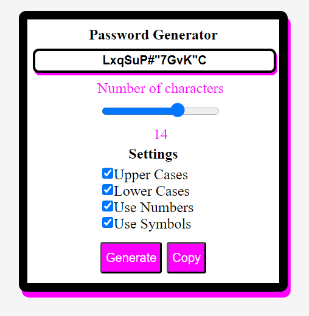

A random password generator app using Angular/typescript. The user can choose the length of the password and the characters to include.
This is an adaptation of the app created using vanilla javascript: https://github.com/YoussefDevCode/PasswordGenVanilla .

